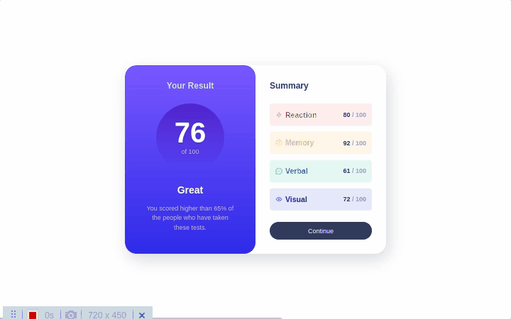
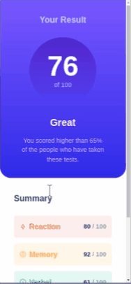

# Frontend Mentor - Results summary component solution


## Table of contents

- [Overview](#overview)
  - [The challenge](#the-challenge)
  - [Screenshot](#screenshot)
  - [Links](#links)
- [My process](#my-process)
  - [Built with](#built-with)
  - [What I learned](#what-i-learned)
  - [Continued development](#continued-development)
  - [Useful resources](#useful-resources)
- [Author](#author)


## Overview


#### Desktop




#### Mobile




## Links

- Site URL: https://nandosti.github.io/results-summary-component-main/

## My process

## Built with

<div style="display: inline_block"><br>
  
         
</div>


## What I learned

Nesse desafio, utilizei variáveis CSS para gerenciar cores e estilos de fonte. Além disso, aprendi sobre responsividade, aplicação de estilos em diferentes elementos HTML, criação de layouts flexíveis com Flexbox e Grid, e implementação de efeitos de hover e focus. Também aprendi sobre fontes personalizadas, gradientes lineares, acessibilidade web e organização de código CSS. São habilidades que, sem dúvida alguma, agregaram muito conhecimento a minha jornada como programador.

```html
<title>Frontend Mentor | Results summary component</title>
    <link rel="stylesheet" href="assets/css/reset.css" />
    <link rel="stylesheet" href="assets/css/style.css" />
```
```css
 .grid-flow[data-spacing="large"] {
    gap: 2rem;
  }
```

## Continued development

Pretendo continuar focado em construir um conhecimento sólido nessas limguagens. Ainda há muitos conceitos importantes para serem desenvolvidos. Todos os dias são gradativamente adicionados ao meu repertório de ferramentas.


## Useful resources

- [W3School](https://www.w3schools.com/css/default.asp) - Esse site sempre me ajuda a resolver qualquer problema relacionados a códigos de uma maneira fácil e muito rápida.
- [Dev em Dobro](https://www.youtube.com/@DevemDobro) - Este é um canal onde encontro muito material. Tem muito conteúdo relacionado ao desenvolvimento. Recomendo a todos que querem aprender sobre esse e outros conceitos relacionados.


## Author

[Fernando Mendes](https://www.linkedin.com/in/fernandomendesti/)


